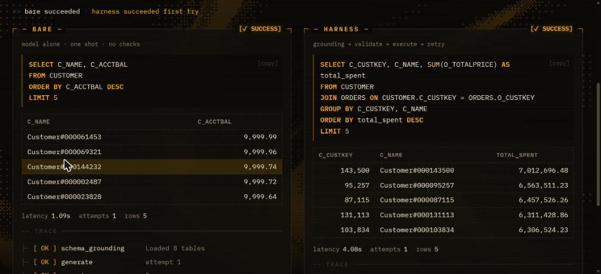
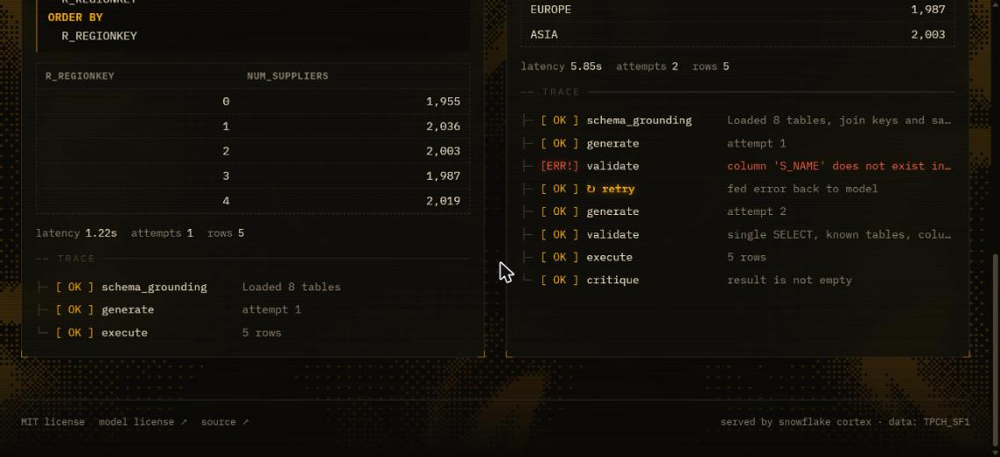
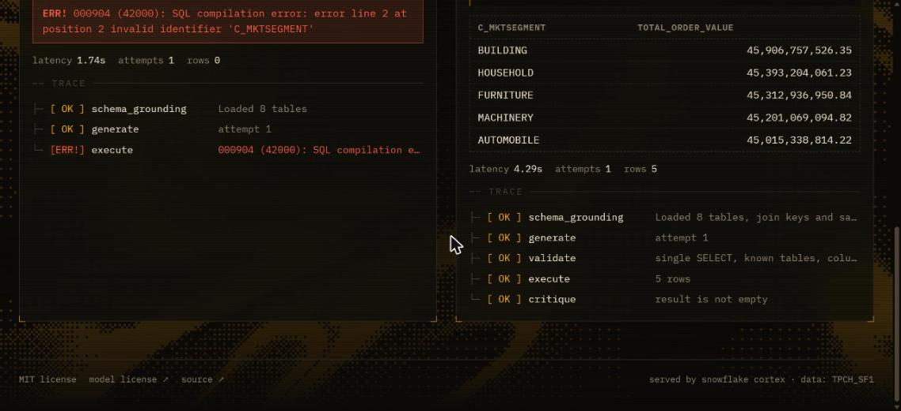
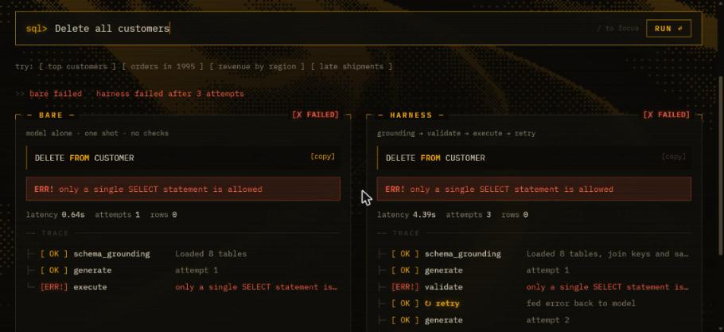

# SmallSQL

> A harness that makes a tiny open-weight model write SQL like a much bigger one, with a dashboard that proves it.

Ask a question about a Snowflake dataset in plain English. The same 8B open-weight model answers it twice, side by side: once on its own, and once inside our harness. The harness grounds the model in the schema, checks its SQL before it runs, feeds errors back, and votes across several candidates. Every step is shown in a trace.

**Result: on 45 plain-English questions, the bare model gets 67% right and the same model inside the harness gets 80%.**

| Mode | Adds | Accuracy |
|---|---|---|
| `bare` | schema text, one shot | 67% |
| `+schema_grounding` | join keys, value lists, business terms, rules | 71% |
| `+validation` | SQL checked before it runs; validation errors fed back | 78% |
| `+retry` | Snowflake errors fed back, empty-result check, 3-candidate vote | 80% |

These numbers are from the run saved in [`benchmark/results.json`](benchmark/results.json). Results move by one or two questions between runs (see [Limitations](#limitations)).

## Demo

| Bare is wrong, harness is right | The harness catches and fixes its own error |
|---|---|
|  |  |

| Bare fails to run | Only SELECT reaches the database |
|---|---|
|  |  |

The benchmark screenshot in `docs/demo/5-benchmark.jpg` is from the earlier 20-question set described under [The two question sets](#the-two-question-sets). A walkthrough script is in [`docs/DEMO.md`](docs/DEMO.md).

## How the harness works

For each question, up to three attempts:

1. **Ground.** The prompt gets the schema (the same text bare mode gets) plus join keys, the values that low-cardinality columns can take, a short glossary of business terms, and dialect rules.
2. **Generate.** The model writes one SQL statement.
3. **Validate.** `sqlglot` parses it. It is rejected unless it is exactly one `SELECT` over real tables and real columns, joined on real key pairs. The error message names every bad column and the closest real one.
4. **Execute.** The query runs on Snowflake with a row limit and a timeout.
5. **Retry.** A validation or execution error goes back to the model with its previous SQL, and it tries again.
6. **Vote.** The full harness writes three candidates in parallel and keeps the result most of them agree on. This is the only stage that can catch a query that runs but answers the wrong question.

The single-`SELECT` guard sits in front of every query in every mode, including bare, so nothing but a read ever reaches Snowflake.

The harness is our own code: [`backend/harness.py`](backend/harness.py), [`backend/schema.py`](backend/schema.py), [`backend/snowflake_client.py`](backend/snowflake_client.py).

## Model

| | |
|---|---|
| Model | `llama3.1-8b` (Meta Llama 3.1, 8B parameters, open weights) |
| Served via | [Snowflake Cortex](https://docs.snowflake.com/en/user-guide/snowflake-cortex/aisql) `COMPLETE` |
| License / terms | [Llama 3.1 Community License](https://www.llama.com/llama3_1/license/) |

The model name is one config value, `CORTEX_MODEL`.

## Dataset

`SNOWFLAKE_SAMPLE_DATA.TPCH_SF1`, which is freely available in every Snowflake account, including trials.

## How Snowflake CoCo was used

CoCo, Snowflake's coding agent, drafted the benchmark. We prompted it in Snowsight to explore `TPCH_SF1` with read-only queries and write questions with a gold SQL query for each. It ran its own queries to learn the schema and value distributions and to check its gold SQL. It did this twice, once per question set below.

Screenshots of the first session are in [`docs/coco/`](docs/coco/).

## How accuracy is measured

Execution accuracy. The generated SQL and the gold SQL are both run on Snowflake and the result sets are compared:

- Column names and column order are ignored; numbers are rounded to two decimals.
- Row order is ignored unless the question asks for a ranking.
- In a ranking, rows that tie on every number may come back in either order.
- Extra or missing columns count as a failure.

The same comparison is applied to every mode. Code: [`backend/compare.py`](backend/compare.py), [`backend/eval_runner.py`](backend/eval_runner.py).

### The two question sets

| File | Questions | Style | Bare | Full harness |
|---|---|---|---|---|
| [`benchmark/questions.json`](benchmark/questions.json) | 45 (8 easy, 17 medium, 20 hard) | Plain English, no column names | 67% | 80% |
| [`benchmark/questions_explicit.json`](benchmark/questions_explicit.json) | 20 | Names the columns and formulas to use | 80% | 90% |

The explicit set was drafted first. Its questions spell out the column names, which does much of the harness's work for the bare model, so we asked CoCo for a second set phrased the way a user would ask. The explicit-set result was measured before the vote and glossary were added and has not been re-run.

## Limitations

- **Small benchmark, one dataset.** 45 questions over TPC-H only. Each question is worth about two points.
- **Not fully repeatable.** The model's output varies slightly between runs. Across six runs on the 45-question set, bare scored 64% to 67% and the full harness 78% to 82%.
- **The harness was tuned on this benchmark.** The business glossary (what "late", "returned", "inventory value" and "order value" mean) and some validator messages were written after seeing which questions failed. A fresh question set would be a fairer test.
- **Gold SQL was checked by running it,** and the outputs were reviewed for plausibility. It was not independently audited query by query.
- **The vote costs three times the model calls** of the other modes.
- **What still fails.** Valid SQL that answers a slightly different question: an unrequested filter, an average over the wrong unit, counting names instead of keys.

## Key dependencies

- Backend: Python 3.11+, FastAPI, snowflake-connector-python, sqlglot
- Frontend: React, Vite, Tailwind CSS

## Repo layout

```
backend/     FastAPI app, harness loop, bare baseline, eval runner
benchmark/   question sets with gold SQL, and cached benchmark results
frontend/    React UI; frontend/mocks/ holds contract-exact JSON for offline dev
docs/        demo script, demo screenshots, CoCo screenshots
SMALLSQL.md  full project spec, including the API contract (Section 5)
```

## Setup

### 1. Environment

```bash
cp .env.example .env   # fill in Snowflake credentials
```

`SNOWFLAKE_PASSWORD` can be a programmatic access token. Use a read-only role.

### 2. Model

Nothing to install: the model runs on Snowflake Cortex. The role in `.env` needs Cortex access; then check the model answers in your account:

```sql
GRANT DATABASE ROLE SNOWFLAKE.CORTEX_USER TO ROLE <your_role>;
SELECT SNOWFLAKE.CORTEX.COMPLETE('llama3.1-8b', 'Reply with the single word OK');
```

### 3. Backend

```bash
cd backend
python3.11 -m venv .venv && source .venv/bin/activate
pip install -r requirements.txt
uvicorn main:app --port 8000
```

### 4. Frontend

```bash
cd frontend
npm install
echo "VITE_USE_MOCKS=false" > .env.local
npm run dev            # http://localhost:5173
```

To run the UI without the backend, set `VITE_USE_MOCKS=true` instead.

### 5. Re-run the benchmark

```bash
cd backend
python eval_runner.py  # writes benchmark/results.json; takes about two minutes
```

## License

MIT. See [LICENSE](LICENSE).
